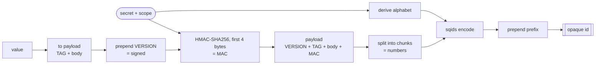
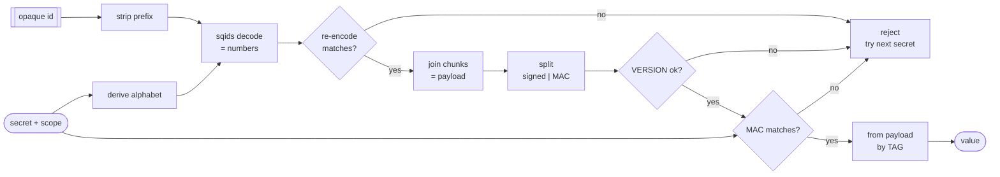

# ScopeMask

Scope-bound opaque id masking.

[](https://github.com/khan-asfi-reza/scopemask/actions/workflows/go.yml)
[](https://github.com/khan-asfi-reza/scopemask/actions/workflows/python.yml)
[](https://github.com/khan-asfi-reza/scopemask/actions/workflows/js.yml)

<!-- docs-home:start -->
ScopeMask converts internal identifiers: database keys, emails, UUIDs, etc into short, opaque strings that are safe to expose in URLs and APIs, and decodes them back to the original value on demand.

Each id is bound to a scope (such as `user` or `order`) and a secret. The same value yields a different id in every scope, and every id carries a keyed integrity check: a modified id, the wrong scope, or the wrong secret is rejected rather than silently decoding to an incorrect value.


## Overview

- **Per-scope alphabet.** The secret and scope derive a unique character alphabet, so ids from different scopes are unrelated and decoding under the wrong scope fails.
- **Integrity.** A short keyed checksum (HMAC) is embedded in every id, so tampering or a wrong secret is detected on decode.
- **Prefixes.** An optional prefix produces readable identifiers such as `usr_...`.
- **Minimum length.** Ids are padded to at least 16 characters by default.
- **Secret rotation.** Retired secrets can still be accepted for decoding.


### Payload layout

Before encoding, the value is wrapped into a byte payload:

```
            payload bytes
┌─────────┬─────────┬───────────┬───────────────┐
│ VERSION │   TAG   │   body    │   MAC (4 B)   │
│  1 byte │ 1 byte  │  n bytes  │  HMAC[:4]     │
└─────────┴─────────┴───────────┴───────────────┘
            └──────── signed ────────┘
                                       └ keyed checksum over (scope + signed)
TAG: 0=int  1=string  2=bytes  3=uuid
```

### Encoding




### Encode:

Wrap the value as `VERSION + TAG + body` (the *signed* bytes); the TAG records the type and the body is the raw bytes. The first 4 bytes of `HMAC-SHA256(secret, scope + signed)` is the MAC and appended to form the payload. Then splits the payload into 6-byte chunks and encode them with sqids using the alphabet derived from the secret and scope, then prepend the prefix.


### Decoding



### Decode:

Strip the prefix and sqids-decode with the secret-and-scope alphabet; reject if re-encoding the numbers does not reproduce the input. Then splits off the MAC, checks the version, and recomputes the MAC, comparing in constant time; rejects on any mismatch. Then reads the TAG to restore the original value and its type. If previous secrets are configured, each is tried until one verifies.
<!-- docs-home:end -->


## Python

### Install

```bash
pip install scopemask
# or
uv add scopemask
```

### Configuration

Create a `ScopeMask` with a secret. The secret is required and is the key every id is derived from; keep it private and stable.

```python
from scopemask import ScopeMask

scope_mask = ScopeMask("parity-secret")
```

Optional keyword arguments:

- `min_length`: pad every id to at least this many characters (default 16).
- `base_alphabet`: the characters ids are built from; must be unique (default A–Z, a–z, 0–9).
- `previous_secrets`: extra secrets accepted when decoding but never used for encoding, so ids made with an old secret keep working after you rotate.

```python
scope_mask = ScopeMask(
    "parity-secret",
    min_length=24,
    base_alphabet="ABCDEFGHJKLMNPQRSTUVWXYZ23456789",
    previous_secrets=("old-secret",),
)
```

### Encode and decode

```python
scope_mask.encode("user", 42)                    # "xgFeePgoWUZHCNLo"
scope_mask.decode("user", "xgFeePgoWUZHCNLo")    # 42
```

### Value types

Integers, strings, bytes, and UUIDs are supported. The original type is restored on decode.

```python
import uuid

scope_mask.encode("user", "hello")                # "yqBiRnZBIdqXslkrXM"
scope_mask.encode("user", b"\x00\x01\xff")        # "RLDIyRQmFljZ1gBD"
scope_mask.encode("user", uuid.UUID("12345678-1234-5678-1234-567812345678"))
# "miQAnixf6TYaACwhThxDJ973X5vSuKqjp2W"
```

### Scopes

The same value produces a different id in each scope.

```python
scope_mask.encode("user", 42)     # "xgFeePgoWUZHCNLo"
scope_mask.encode("order", 42)    # "8DGttE8msCZHsJVG"
```

### Prefixes

Add a prefix for readable ids. Pass the same prefix when decoding.

```python
scope_mask.encode("user", 42, prefix="id_")        # "id_xgFeePgoWUZHCNLo"
scope_mask.encode("webhook", 42, prefix="whs_")    # "whs_jU5IIH0OxGnQg5u1"
scope_mask.decode("user", "id_xgFeePgoWUZHCNLo", prefix="id_")   # 42
```

### Bound scope

Bind a scope and prefix once, then call the same methods without repeating them.

```python
users = scope_mask.scope("user", prefix="id_")

users.encode(42)                     # "id_xgFeePgoWUZHCNLo"
users.decode("id_xgFeePgoWUZHCNLo")  # 42
users.try_decode("not-a-real-id")    # None

ids = users.encode_many([1, 2, 3])
users.decode_many(ids)               # [1, 2, 3]
users.try_decode_many(ids)           # [1, 2, 3]
```

### Batch operations

```python
ids = scope_mask.encode_many("user", [1, 2, 3])
scope_mask.decode_many("user", ids)   # [1, 2, 3]
```

### Safe decoding

`decode` raises `InvalidId` on an invalid id. Use `try_decode` to get `None` instead.

```python
scope_mask.try_decode("user", "not-a-real-id")         # None
scope_mask.try_decode_many("user", ["not-a-real-id"])  # [None]
scope_mask.encode("user", None)                        # None
```

## JavaScript / TypeScript

Runs in Node, Deno, Bun, and edge runtimes such as Cloudflare Workers and Vercel Edge.

### Install

```bash
npm install scopemask
yarn add scopemask
pnpm add scopemask
```

### Configuration

Create a `ScopeMask` with a secret. The secret is required and is the key every id is derived from; keep it private and stable.

```ts
import { ScopeMask } from "scopemask";

const scopeMask = new ScopeMask("parity-secret");
```

Optional settings:

- `minLength`: pad every id to at least this many characters (default 16).
- `baseAlphabet`: the characters ids are built from; must be unique (default A–Z, a–z, 0–9).
- `previousSecrets`: extra secrets accepted when decoding but never used for encoding, so ids made with an old secret keep working after you rotate.

```ts
new ScopeMask("parity-secret", {
  minLength: 24,
  baseAlphabet: "ABCDEFGHJKLMNPQRSTUVWXYZ23456789",
  previousSecrets: ["old-secret"],
});
```

### Encode and decode

```ts
scopeMask.encode("user", 42);                    // "xgFeePgoWUZHCNLo"
scopeMask.decode("user", "xgFeePgoWUZHCNLo");    // 42
```

### Value types

Numbers, bigints, strings, byte arrays, and UUIDs are supported. The original type is restored on decode.

```ts
import { UUID } from "scopemask";

scopeMask.encode("user", "hello");                  // "yqBiRnZBIdqXslkrXM"
scopeMask.encode("user", Uint8Array.of(0, 1, 255)); // "RLDIyRQmFljZ1gBD"
scopeMask.encode("user", UUID.parse("12345678-1234-5678-1234-567812345678"));
// "miQAnixf6TYaACwhThxDJ973X5vSuKqjp2W"
```

### Scopes

The same value produces a different id in each scope.

```ts
scopeMask.encode("user", 42);     // "xgFeePgoWUZHCNLo"
scopeMask.encode("order", 42);    // "8DGttE8msCZHsJVG"
```

### Prefixes

Add a prefix for readable ids. Pass the same prefix when decoding.

```ts
scopeMask.encode("user", 42, "id_");       // "id_xgFeePgoWUZHCNLo"
scopeMask.encode("webhook", 42, "whs_");   // "whs_jU5IIH0OxGnQg5u1"
scopeMask.decode("user", "id_xgFeePgoWUZHCNLo", "id_");   // 42
```

### Bound scope

Bind a scope and prefix once, then call the same methods without repeating them.

```ts
const users = scopeMask.scope("user", "id_");

users.encode(42);                     // "id_xgFeePgoWUZHCNLo"
users.decode("id_xgFeePgoWUZHCNLo");  // 42
users.tryDecode("not-a-real-id");     // null

const ids = users.encodeMany([1, 2, 3]) as string[];
users.decodeMany(ids);                // [1, 2, 3]
users.tryDecodeMany(ids);             // [1, 2, 3]
```

### Batch operations

```ts
const ids = scopeMask.encodeMany("user", [1, 2, 3]) as string[];
scopeMask.decodeMany("user", ids);   // [1, 2, 3]
```

### Safe decoding

`decode` throws `InvalidId` on an invalid id. Use `tryDecode` to get `null` instead.

```ts
scopeMask.tryDecode("user", "not-a-real-id");          // null
scopeMask.tryDecodeMany("user", ["not-a-real-id"]);    // [null]
scopeMask.encode("user", null);                        // null
```

## Golang

### Install

```bash
go get github.com/khan-asfi-reza/scopemask/go@latest
```

### Configuration

Create a `ScopeMask` with a secret. The secret is required and is the key every id is derived from; keep it private and stable.

```go
import scopemask "github.com/khan-asfi-reza/scopemask/go"

scopeMask, _ := scopemask.New("parity-secret")
```

Optional functions:

- `WithMinLength(n)`: pad every id to at least `n` characters (default 16).
- `WithBaseAlphabet(a)`: the characters ids are built from; must be unique (default A–Z, a–z, 0–9).
- `WithPreviousSecrets(...)`: extra secrets accepted when decoding but never used for encoding, so ids made with an old secret keep working after you rotate.

```go
scopeMask, _ = scopemask.New(
    "parity-secret",
    scopemask.WithMinLength(24),
    scopemask.WithBaseAlphabet("ABCDEFGHJKLMNPQRSTUVWXYZ23456789"),
    scopemask.WithPreviousSecrets("old-secret"),
)
```

### Encode and decode

`Encode` and `Decode` are generic over the value type, and `Decode[T]` returns that concrete type.

```go
id, _ := scopemask.Encode(scopeMask, "user", uint64(42), "")   // "xgFeePgoWUZHCNLo"
v, _ := scopemask.Decode[uint64](scopeMask, "user", id, "")     // 42
```

### Value types

Integers, strings, byte slices, and UUIDs are supported.

```go
scopemask.Encode(scopeMask, "user", "hello", "")            // "yqBiRnZBIdqXslkrXM"
scopemask.Encode(scopeMask, "user", []byte{0, 1, 255}, "")  // "RLDIyRQmFljZ1gBD"

u, _ := scopemask.ParseUUID("12345678-1234-5678-1234-567812345678")
scopemask.Encode(scopeMask, "user", u, "")                  // "miQAnixf6TYaACwhThxDJ973X5vSuKqjp2W"
```

### Scopes

The same value produces a different id in each scope.

```go
scopemask.Encode(scopeMask, "user", uint64(42), "")    // "xgFeePgoWUZHCNLo"
scopemask.Encode(scopeMask, "order", uint64(42), "")   // "8DGttE8msCZHsJVG"
```

### Prefixes

Add a prefix for readable ids. Pass the same prefix when decoding.

```go
scopemask.Encode(scopeMask, "user", uint64(42), "id_")       // "id_xgFeePgoWUZHCNLo"
scopemask.Encode(scopeMask, "webhook", uint64(42), "whs_")   // "whs_jU5IIH0OxGnQg5u1"
scopemask.Decode[uint64](scopeMask, "user", "id_xgFeePgoWUZHCNLo", "id_")   // 42
```

### Bound scope

Bind a scope and prefix once, then pass the handle to the `*In` functions.

```go
users := scopeMask.Scope("user", "id_")

id, _ := scopemask.EncodeIn(users, uint64(42))                   // "id_xgFeePgoWUZHCNLo"
v, _ := scopemask.DecodeIn[uint64](users, id)                     // 42
_, ok := scopemask.TryDecodeIn[uint64](users, "not-a-real-id")   // ok == false

ids, _ := scopemask.EncodeManyIn(users, []uint64{1, 2, 3})
vals, _ := scopemask.DecodeManyIn[uint64](users, ids)            // [1 2 3]
tried, oks := scopemask.TryDecodeManyIn[uint64](users, ids)
```

### Batch operations

```go
ids, _ := scopemask.EncodeMany(scopeMask, "user", []uint64{1, 2, 3}, "")
vals, _ := scopemask.DecodeMany[uint64](scopeMask, "user", ids, "")   // [1 2 3]
```

### Safe decoding

`TryDecode` reports validity instead of returning an error. `Decode` returns an error matching `scopemask.ErrInvalidID` on an invalid id or wrong type.

```go
v, ok := scopemask.TryDecode[uint64](scopeMask, "user", id, "")
vals, oks := scopemask.TryDecodeMany[uint64](scopeMask, "user", ids, "")
```

---

Built on [sqids](https://sqids.org) for the short, reversible encoding.
